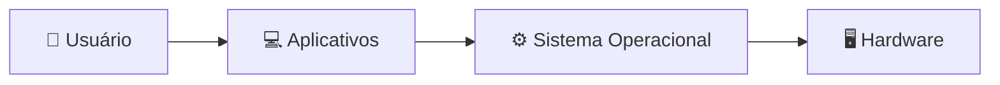
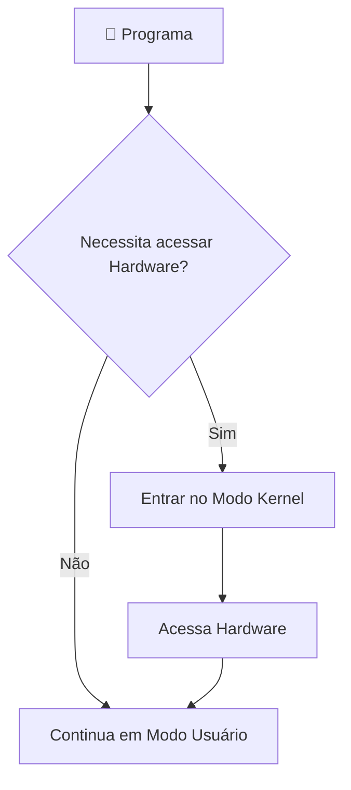

# 📚 Apresentação da Disciplina e Introdução aos Sistemas Operacionais

> **Disciplina:** Sistemas Operacionais  
> **Tema:** Apresentação da Disciplina e Introdução aos Sistemas Operacionais

---

# 🎯 Objetivos da Aula

Nesta primeira aula foram apresentados:

- 📖 O plano da disciplina;
- 👨‍🏫 A metodologia de ensino;
- 📝 Os critérios de avaliação;
- 💻 O conceito de Sistemas Operacionais;
- ⚙️ Os principais assuntos que serão estudados durante o semestre.

---

# 🗺️ Mapa Mental da Aula

```text
                        💻 Sistemas Operacionais
                                 │
        ┌────────────────────────┼─────────────────────────┐
        │                        │                         │
    📚 Disciplina           ⚙️ Conceitos             📈 Avaliação
        │                        │                         │
        │                        │                         │
 Plano de ensino           Kernel                  P1
 Metodologia               Processos               P2
 Cronograma                Memória                Projeto
 Atividades                Arquivos               Atividades
                            Segurança
                           Virtualização
```

---

# 💻 O que é um Sistema Operacional?

Um **Sistema Operacional (SO)** é o software responsável por controlar o funcionamento do computador, gerenciando o hardware e os programas, além de servir como intermediário entre o usuário e a máquina.

## 🎯 Principais funções

| Função | Descrição |
|---------|-----------|
| 🖥️ Gerenciar Hardware | Controla CPU, memória e dispositivos |
| 📂 Gerenciar Arquivos | Organiza e controla os dados |
| ⚙️ Executar Programas | Coordena a execução dos processos |
| 👤 Interface com o Usuário | Permite a interação entre usuário e computador |

---

# 🖥️ Exemplos de Sistemas Operacionais

| Desktop | Mobile |
|----------|---------|
| 🪟 Windows | 🤖 Android |
| 🍎 macOS | 📱 iOS |
| 🐧 Linux | |

---

# 🔄 Funcionamento Básico do Sistema Operacional



---

# ⚙️ Estrutura Interna do Sistema Operacional

## 🧠 Kernel

O **Kernel** é o núcleo do Sistema Operacional.

Ele possui acesso direto ao hardware e controla os recursos mais importantes do computador.

### Responsabilidades

- 🧠 Gerenciar memória
- ⚙️ Controlar processos
- 💾 Gerenciar dispositivos
- 📂 Controlar arquivos

---

## 🏛️ Modos de Operação

| 👤 Modo Usuário | ⚙️ Modo Kernel |
|----------------|---------------|
| Executa programas comuns | Executa funções críticas |
| Acesso limitado | Acesso total ao hardware |
| Mais seguro | Maior privilégio |

---

# 🔄 Fluxograma dos Modos



---

# ⏳ Escalonamento de Processos

O escalonamento define **qual processo será executado pelo processador e durante quanto tempo**.

## 🎯 Objetivos

- 🚀 Melhor desempenho
- ⚖️ Justiça entre processos
- ⏱️ Menor tempo de resposta

---

## 📊 Algoritmos apresentados

| Algoritmo | Característica |
|------------|----------------|
| FIFO | Primeiro que chega é o primeiro a executar |
| Round Robin | Divide igualmente o tempo entre processos |
| Prioridade | Executa primeiro os processos mais importantes |

---

# 🔄 Fluxograma Simplificado do Escalonador


---

# 🧠 Gerenciamento de Memória

O Sistema Operacional controla toda a utilização da memória do computador.

## 📌 Memória Principal

- 📦 Alocação dinâmica
- 🔒 Proteção da memória

---

## 💾 Memória Virtual

Permite utilizar parte do disco como extensão da memória RAM.

### Benefícios

- 📈 Maior capacidade lógica
- 🔐 Segurança
- 🔄 Flexibilidade

---

# 🗂️ Gerenciamento de Recursos

| Recurso | Responsabilidade do SO |
|----------|------------------------|
| 💾 Memória | Alocar e proteger |
| 🖥️ CPU | Executar processos |
| ⌨️ Dispositivos | Controlar periféricos |
| 📂 Arquivos | Organizar dados |

---

# 📁 Dispositivos e Arquivos

O Sistema Operacional também realiza:

- ⌨️ Gerenciamento de entrada e saída;
- 📂 Organização dos arquivos;
- 🔒 Segurança do sistema;
- ☁️ Virtualização.

---

# 📌 Conteúdos do Semestre

```text
📚 Sistemas Operacionais
│
├── ⚙️ Estrutura Interna
├── 🧠 Kernel
├── ⏳ Escalonamento
├── 💾 Memória
├── 📂 Sistemas de Arquivos
├── ⌨️ Entrada e Saída
├── 🔒 Segurança
└── ☁️ Virtualização
```

---

# 💼 Importância do Portfólio

Segundo o professor, manter um portfólio permite:

- 📂 Demonstrar projetos realizados;
- 💼 Facilitar oportunidades de estágio;
- 🚀 Mostrar evolução profissional;
- 📈 Comprovar habilidades práticas.

---

# 📝 Critérios de Avaliação

## 📊 Distribuição

| Avaliação | Peso |
|------------|------|
| 📝 P1 | 25% |
| 📝 P2 | 25% |
| 💻 Projeto (PJ) + Atividades (AT) | 25% *(conforme fórmula apresentada)* |

### Fórmula

```text
(P1 × 0,25) + (P2 × 0,25) + ((PJ + AT) × 0,25)
```

---

# 📋 Atividades da Aula

- 👥 Formar grupos de 3 a 5 integrantes;
- 📄 Enviar os nomes dos participantes;
- 🐙 Criar um repositório no GitHub;
- 📝 Elaborar este resumo em Markdown;
- 🧠 Criar uma linha do tempo em mapa mental no Miro e convertê-la para Markdown.

---

# 📌 Resumo Geral

| Tema | Ideia Principal |
|------|-----------------|
| 💻 Sistema Operacional | Gerencia hardware e software |
| ⚙️ Kernel | Núcleo do sistema |
| 👤 Modos | Usuário e Kernel |
| ⏳ Processos | Escalonamento |
| 💾 Memória | RAM e Memória Virtual |
| 📂 Arquivos | Organização dos dados |
| 🔒 Segurança | Proteção do sistema |
| ☁️ Virtualização | Melhor aproveitamento dos recursos |

---

# ✅ Conclusão

Esta aula teve como objetivo apresentar a disciplina e introduzir os principais conceitos de Sistemas Operacionais. Foram apresentados o funcionamento geral do SO, a importância do Kernel, o gerenciamento de processos, memória, dispositivos e arquivos, além dos critérios de avaliação e das atividades que serão desenvolvidas durante o semestre.

> 💡 **Dica:** Este resumo já está formatado para ser utilizado diretamente no `README.md` do repositório da disciplina no GitHub.
