# 🖥️ Sistemas Operacionais — História

> 📚 **Resumo geral sobre a evolução dos Sistemas Operacionais**
>
> 🎯 Foco: história, evolução, principais problemas e soluções.
>
> 🧠 Material visual para estudo e revisão.

---

## 🗺️ Mapa mental principal

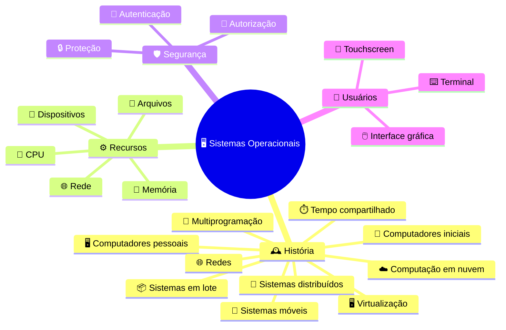

---

# 🕰️ Linha do tempo

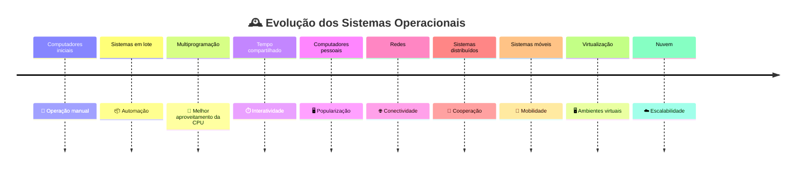

---

# 🖼️ 1. Computadores antigos


Os primeiros computadores eram enormes, caros e difíceis de operar.

👨‍🔧 A operação dependia de especialistas.

🏢 Muitos equipamentos ocupavam salas inteiras.

💰 O acesso era extremamente limitado.

### 📊 Características

| Característica   | 🧮 Primeiros computadores |
| ---------------- | ------------------------- |
| 🖥️ Tamanho      | Muito grande              |
| 💰 Custo         | Muito elevado             |
| 👥 Usuários      | Poucos                    |
| 🔧 Operação      | Manual                    |
| 💾 Armazenamento | Limitado                  |
| 🌐 Redes         | Praticamente inexistentes |

---

# 🎞️ GIF — evolução dos computadores


> 🎬 O GIF pode mostrar a evolução de máquinas gigantes para computadores pessoais e dispositivos móveis.

---

# 🔧 2. Operação manual

Nos primeiros computadores, o operador precisava realizar diversas tarefas manualmente.

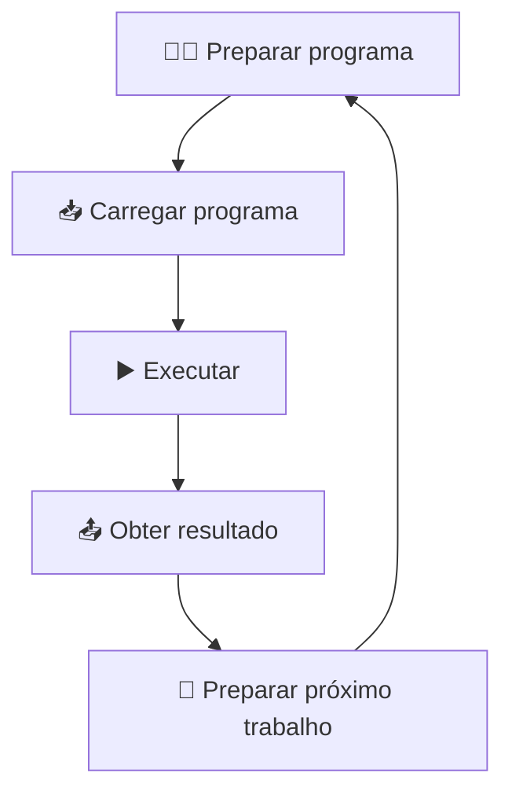

### ❌ Problema

O computador podia permanecer parado durante a preparação do próximo trabalho.

> ⚠️ **CPU parada significa recurso computacional desperdiçado.**

---

# 📦 3. Sistemas em lote

Uma solução foi agrupar vários trabalhos.


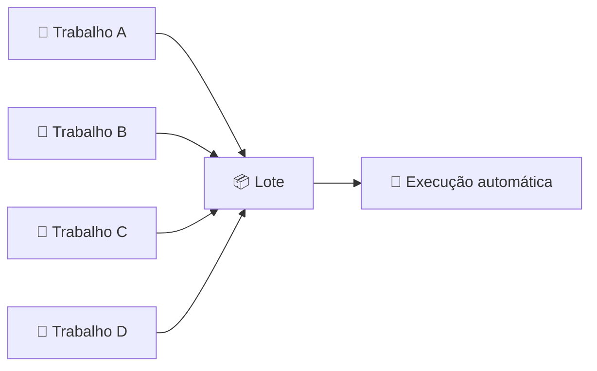

### 🎯 Objetivo

Reduzir a intervenção humana.

### 📊 Antes x depois

| 🔧 Aspecto            | ❌ Antes | ✅ Lote |
| --------------------- | ------- | ------ |
| 👨‍🔧 Trabalho manual | Alto    | Menor  |
| 🤖 Automação          | Baixa   | Maior  |
| ⏱️ Tempo desperdiçado | Alto    | Menor  |
| 📈 Eficiência         | Baixa   | Melhor |

---

# 🎞️ GIF — processamento em lote


```text
📄 A
 ↓
📄 B
 ↓
📄 C
 ↓
📄 D
 ↓
🤖 EXECUÇÃO
```

---

# 🧠 4. Monitor residente

Uma ideia importante foi manter um programa especial na memória para controlar os trabalhos.

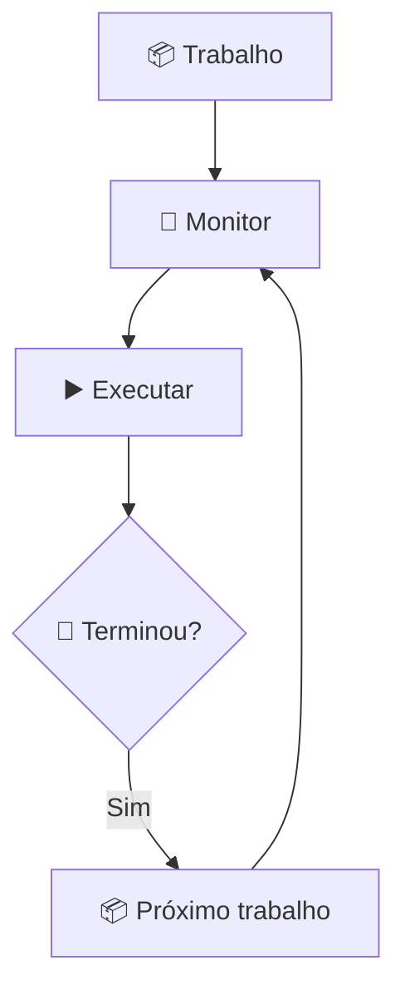

### 🧠 Funções conceituais

* 📋 Organizar trabalhos
* ▶️ Iniciar programas
* 🔄 Passar para o próximo trabalho
* ⚙️ Controlar a execução

---

# 🐌 5. O problema da CPU ociosa

Mesmo com sistemas em lote, surgiu outro problema.

Imagine um programa esperando uma operação de entrada e saída.

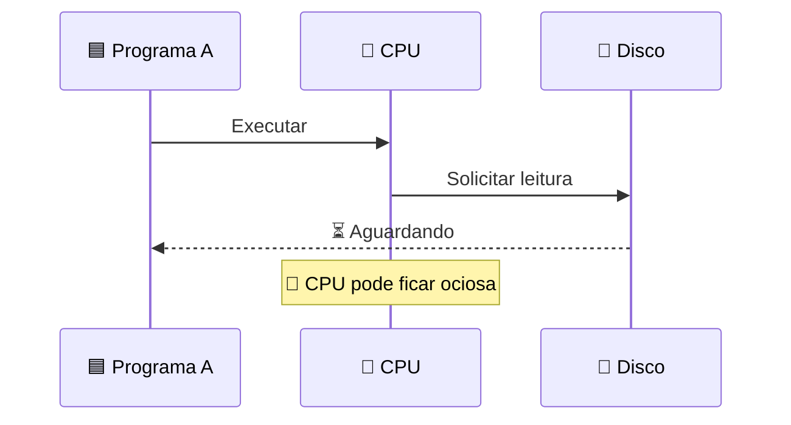

### ❌ Problema

```text
🟦 Programa
    ↓
💾 Espera pelo disco
    ↓
⏳
    ↓
🧠 CPU sem trabalho
```

### 💡 Solução

Manter outros programas disponíveis.

➡️ Surge a **multiprogramação**.

---

# 🔀 6. Multiprogramação

A multiprogramação permite manter vários programas disponíveis.


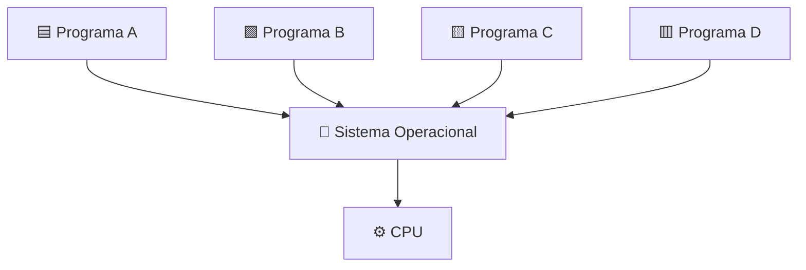

Se A estiver esperando, outro processo pode executar.

```text
🟦 A → ⏳ Esperando

🟩 B → ▶️ Executando

🟨 C → 🟢 Pronto

🟥 D → ⏳ Esperando
```

---

# 🎞️ GIF — multiprogramação


> 💡 O GIF deve mostrar a CPU alternando entre diferentes tarefas.

---

# 📊 7. Multiprogramação

| 🧩 Elemento         | 🎯 Função                         |
| ------------------- | --------------------------------- |
| 🧠 CPU              | Executar instruções               |
| 💾 Memória          | Manter programas                  |
| 🔀 Multiprogramação | Manter várias tarefas disponíveis |
| ⚙️ SO               | Gerenciar recursos                |
| 📂 I/O              | Comunicação com dispositivos      |

> ⭐ **Para memorizar:**
>
> 🔀 Multiprogramação = **vários programas disponíveis para aproveitar melhor os recursos.**

---

# ⏱️ 8. Tempo compartilhado

A evolução seguinte foi o **tempo compartilhado**.

Agora o computador poderia atender vários usuários de maneira interativa.


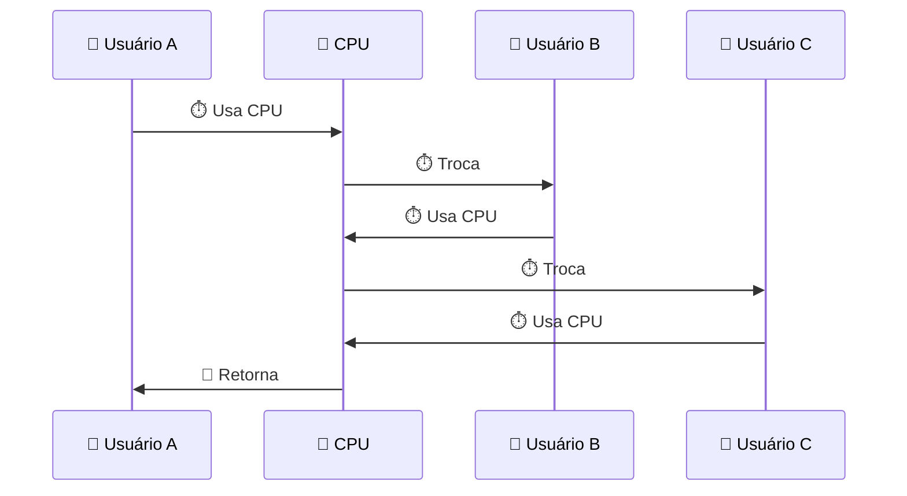

### 🎯 Objetivo

Permitir que diversos usuários interajam com o computador.

---

# 🎞️ GIF — tempo compartilhado


```text
👤 A
 ↓
⏱️ CPU
 ↓
👤 B
 ↓
⏱️ CPU
 ↓
👤 C
 ↓
⏱️ CPU
 ↓
🔄 A
```

---

# 👥 9. Usuários e terminais

Os sistemas de tempo compartilhado permitiram uma interação mais direta.

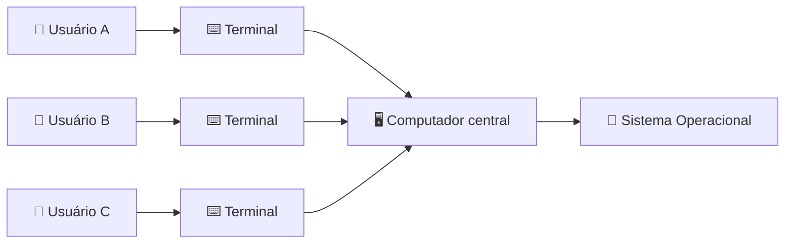

---

# 🎨 10. Interfaces gráficas

Com a popularização dos computadores pessoais, as interfaces gráficas ganharam importância.


### 🖱️ Elementos

* 🪟 Janelas
* 📁 Pastas
* 📄 Arquivos
* 🖱️ Mouse
* 📋 Menus
* 🖼️ Ícones

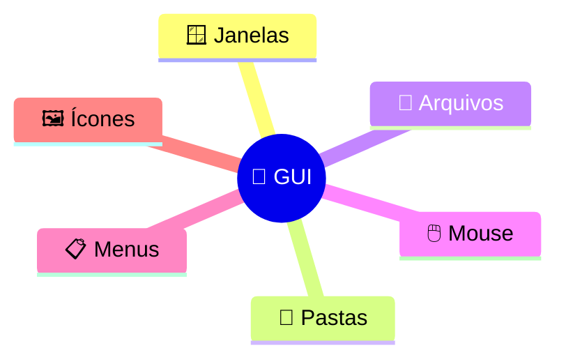

---

# 🖥️ 11. Computadores pessoais

A computação deixou gradualmente de ser exclusiva de grandes instituições.


### 📈 Mudança

| Antes                 | Depois                  |
| --------------------- | ----------------------- |
| 🏢 Computador central | 🏠 Computador pessoal   |
| 👨‍🔬 Especialistas   | 👥 Público geral        |
| ⌨️ Comandos           | 🖱️ Interfaces gráficas |
| 💰 Muito caro         | 💵 Mais acessível       |

---

# 🌐 12. Redes

Computadores começaram a ser conectados.


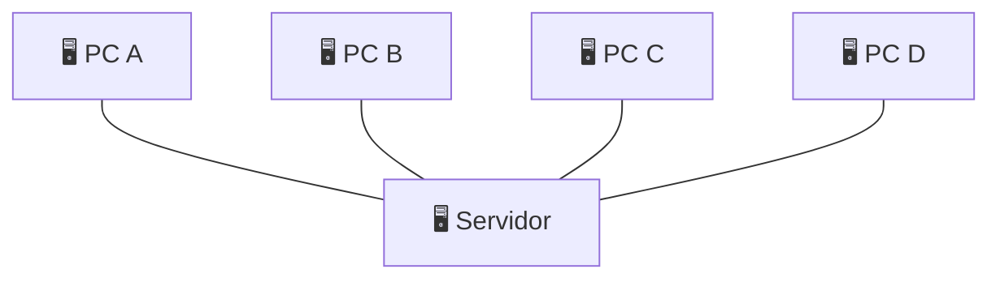

### 🔗 Possibilidades

* 📂 Compartilhamento de arquivos
* 🖨️ Impressoras compartilhadas
* 💬 Comunicação
* 🌐 Serviços de rede
* 🗄️ Servidores

---

# 🎞️ GIF — redes


```text
🖥️ A ───┐
🖥️ B ───┼── 🌐 REDE ── 🖥️ SERVIDOR
🖥️ C ───┘
```

---

# 🧩 13. Sistemas distribuídos

Vários computadores podem cooperar para realizar tarefas.


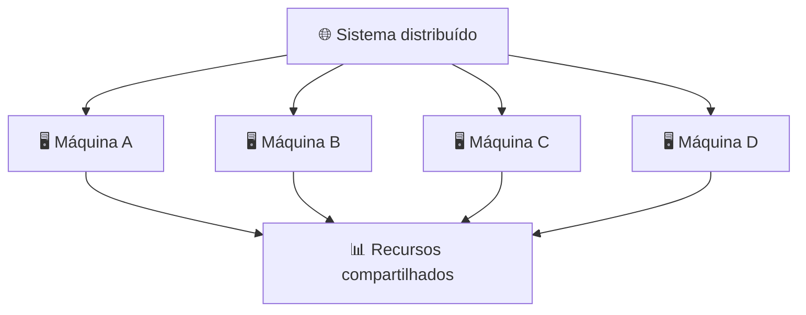

### 🎯 Objetivos

* 📈 Aumentar capacidade
* 🔄 Distribuir tarefas
* 📂 Compartilhar recursos
* 🌐 Melhorar conectividade
* 🧩 Dividir responsabilidades

---

# 📱 14. Sistemas móveis

Smartphones e tablets trouxeram novos desafios.


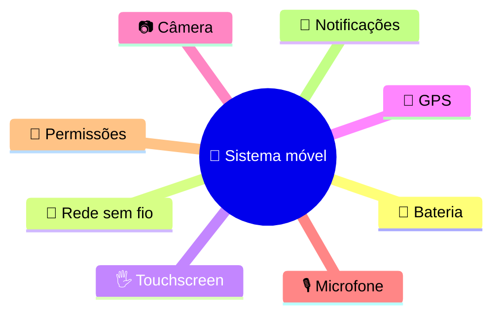

### 📊 PC x Mobile

| 💻 PC                    | 📱 Mobile          |
| ------------------------ | ------------------ |
| 🔌 Energia disponível    | 🔋 Bateria         |
| 🖱️ Mouse                | 🖐️ Toque          |
| 🖥️ Tela grande          | 📱 Tela menor      |
| 🌐 Rede geralmente fixa  | 📡 Rede móvel      |
| ⚙️ Mais recursos físicos | 🔋 Mais restrições |

---

# 🖥️ 15. Virtualização

A virtualização permite criar ambientes virtuais sobre um mesmo hardware físico.


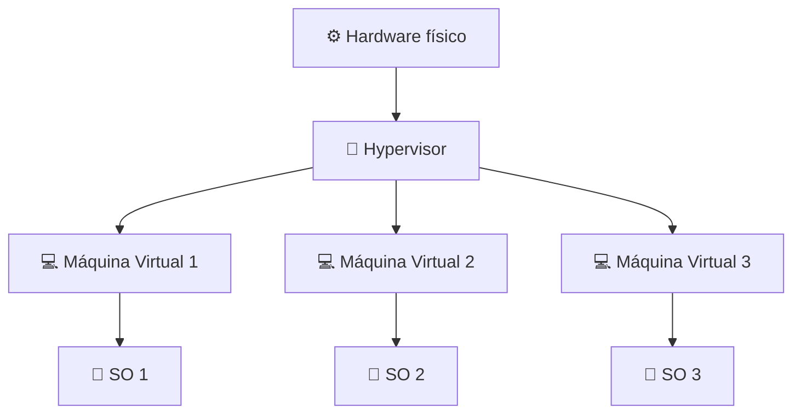

### 🧩 Benefícios

* 🔒 Isolamento
* 📈 Melhor aproveitamento
* 🧪 Testes
* ☁️ Infraestrutura de nuvem
* 🔄 Flexibilidade

---

# ☁️ 16. Computação em nuvem

A computação em nuvem permite utilizar recursos computacionais por meio de redes.


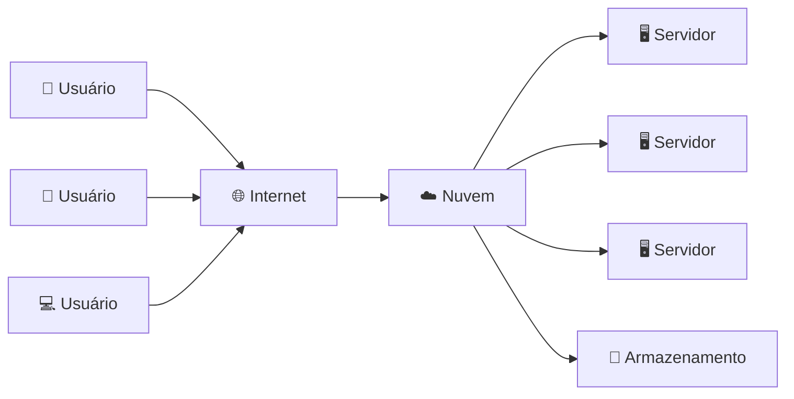

### ☁️ Recursos

* 💾 Armazenamento
* 🧠 Processamento
* 🌐 Redes
* 🖥️ Máquinas virtuais
* 📦 Aplicações

---

# 🎞️ GIF — computação em nuvem


---

# ⚙️ 17. Kernel

O kernel é o núcleo do sistema operacional.

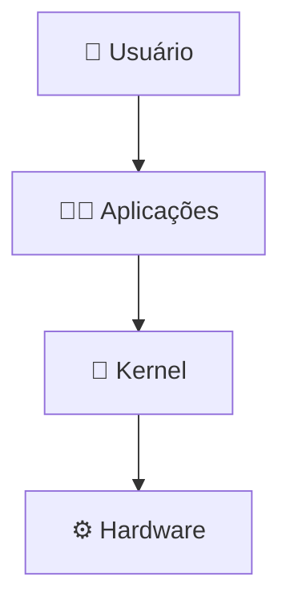

### 🧠 Principais responsabilidades

| Área            | Função                  |
| --------------- | ----------------------- |
| 🔄 Processos    | Controlar execução      |
| 🧠 Memória      | Gerenciar memória       |
| 📂 Arquivos     | Gerenciar armazenamento |
| 🔌 Dispositivos | Controlar hardware      |
| 🌐 Rede         | Comunicação             |
| 🛡️ Proteção    | Isolar recursos         |

---

# 🔄 18. Processos

Um processo pode ser entendido como um programa em execução.

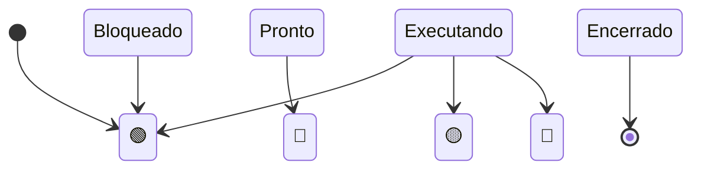

### 📊 Estados

| Estado        | Significado    |
| ------------- | -------------- |
| 🟢 Pronto     | Aguarda CPU    |
| 🔵 Executando | Usa CPU        |
| 🟡 Bloqueado  | Aguarda evento |
| 🔴 Encerrado  | Terminou       |

---

# 🧠 19. Memória

O sistema operacional precisa controlar a memória disponível.

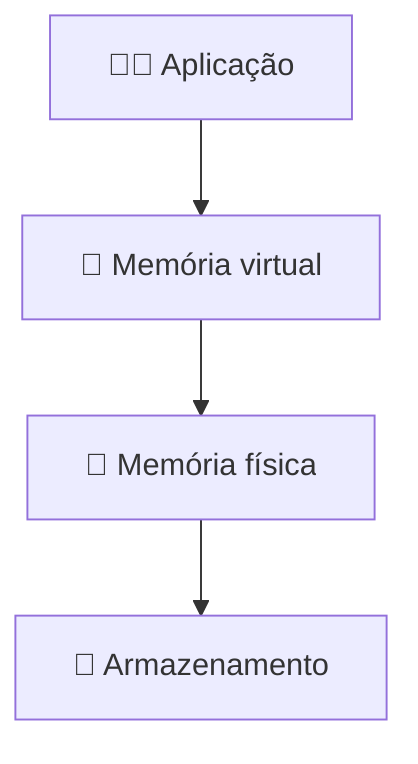

### 🎯 Objetivos

* 📦 Alocar memória
* 🗑️ Liberar memória
* 🔒 Proteger processos
* 🔄 Organizar recursos
* 📈 Aproveitar melhor a memória

---

# 📂 20. Sistemas de arquivos

Arquivos fornecem uma forma organizada de armazenar informações.

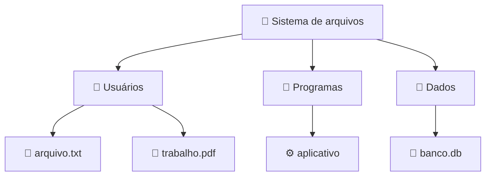

---

# 🔌 21. Dispositivos

O sistema operacional também precisa controlar dispositivos.

| 🔌 Dispositivo | 📥📤 Tipo     |
| -------------- | ------------- |
| ⌨️ Teclado     | Entrada       |
| 🖱️ Mouse      | Entrada       |
| 🖨️ Impressora | Saída         |
| 💾 Disco       | Armazenamento |
| 📡 Rede        | Comunicação   |
| 🎧 Áudio       | Multimídia    |
| 📷 Câmera      | Entrada       |

---

# 🛠️ 22. Drivers

Drivers ajudam o sistema operacional a controlar diferentes dispositivos.

```mermaid
flowchart TD
    A[🧑‍💻 Aplicação]
    B[🧠 Sistema Operacional]
    C[🛠️ Driver]
    D[🔌 Hardware]

    A --> B
    B --> C
    C --> D
```

> 💡 **Driver = ponte entre o SO e determinado hardware.**

---

# 🔐 23. Segurança

Com o crescimento das redes, segurança tornou-se cada vez mais importante.

```mermaid
flowchart TD
    U[👤 Usuário]
    A[🔑 Autenticação]
    B[🪪 Autorização]
    C[🔒 Proteção]
    D[💾 Recursos]

    U --> A
    A --> B
    B --> C
    C --> D
```

### 🛡️ Componentes

| 🔐 Mecanismo    | 🎯 Objetivo          |
| --------------- | -------------------- |
| 🔑 Autenticação | Confirmar identidade |
| 🪪 Autorização  | Controlar permissões |
| 🔒 Criptografia | Proteger dados       |
| 🧱 Isolamento   | Separar ambientes    |
| 🧾 Auditoria    | Registrar ações      |

---

# 🧠 24. Mapa mental — recursos do SO

```mermaid
mindmap
  root((🧠 Sistema Operacional))
    ⚙️ Processador
      🔄 Processos
      ⏱️ Escalonamento
    🧠 Memória
      📦 Alocação
      🔒 Proteção
    💾 Armazenamento
      📂 Arquivos
      📁 Diretórios
    🔌 Dispositivos
      🛠️ Drivers
      📥 Entrada
      📤 Saída
    🌐 Redes
      📡 Comunicação
      🔗 Conectividade
    🛡️ Segurança
      🔑 Identidade
      🪪 Permissões
```

---

# 🧭 25. Grande mapa mental da história

```mermaid
mindmap
  root((🕰️ História dos SOs))
    🧮 Primeiros computadores
      👨‍🔧 Operação manual
      🏢 Máquinas enormes
      💰 Alto custo
    📦 Sistemas em lote
      🤖 Automação
      📋 Trabalhos agrupados
    🔀 Multiprogramação
      🧠 CPU
      📦 Vários programas
      📈 Eficiência
    ⏱️ Time-sharing
      👥 Usuários
      ⌨️ Terminais
      💬 Interação
    🖥️ PCs
      🏠 Computação doméstica
      🖱️ GUI
    🌐 Redes
      📂 Compartilhamento
      📡 Comunicação
    🧩 Distribuídos
      🖥️ Várias máquinas
      🔄 Cooperação
    📱 Mobile
      🔋 Bateria
      📡 Mobilidade
    🖥️ Virtualização
      🧩 Máquinas virtuais
      🔒 Isolamento
    ☁️ Nuvem
      📈 Escala
      💾 Recursos remotos
```

---

# 📊 26. Comparação histórica

| Era                 | 👥 Usuários | ⚙️ Foco       | 🌐 Rede | 💬 Interação |
| ------------------- | ----------: | ------------- | ------- | ------------ |
| 🧮 Inicial          |      Poucos | Execução      | 🔴      | 🔴           |
| 📦 Lote             |      Poucos | Automação     | 🔴      | 🔴           |
| 🔀 Multiprogramação |      Vários | Eficiência    | 🔴      | 🟡           |
| ⏱️ Time-sharing     |      Vários | Interação     | 🟡      | 🟢           |
| 🖥️ PC              | 1 ou poucos | Usabilidade   | 🟡      | 🟢           |
| 🌐 Redes            |      Muitos | Conectividade | 🟢      | 🟢           |
| 🧩 Distribuído      |      Muitos | Cooperação    | 🟢      | 🟢           |
| 📱 Mobile           |      Muitos | Mobilidade    | 🟢      | 🟢           |
| ☁️ Nuvem            |      Muitos | Escala        | 🟢      | 🟢           |

---

# 🔥 27. Problema → solução

```mermaid
flowchart TD
    A[👨‍🔧 Muito trabalho manual]
    B[📦 Sistemas em lote]
    C[🐌 CPU ociosa]
    D[🔀 Multiprogramação]
    E[👥 Necessidade de interação]
    F[⏱️ Time-sharing]
    G[🌐 Computadores isolados]
    H[🌐 Redes]
    I[📈 Necessidade de escala]
    J[☁️ Nuvem]

    A --> B
    B --> C
    C --> D
    D --> E
    E --> F
    F --> G
    G --> H
    H --> I
    I --> J
```

---

# 🎞️ 28. GIF — evolução completa


### 🧮 → 📦 → 🔀 → ⏱️ → 🖥️ → 🌐 → 🧩 → 📱 → 🖥️ → ☁️

---

# 🖼️ 29. Galeria

## 🧮 Computadores iniciais


## 📦 Sistemas em lote


## 🔀 Multiprogramação


## ⏱️ Tempo compartilhado


## 🖥️ Computador pessoal


## 🌐 Redes


## ☁️ Nuvem


---

# 🎥 30. Mídia avançada

```html
<video controls width="720">
  <source src="./midia/historia-sistemas-operacionais.mp4" type="video/mp4">
</video>
```

🎬 Vídeo sugerido:

**Evolução dos computadores e sistemas operacionais.**

---

# 🎧 31. Áudio

```html
<audio controls>
  <source src="./midia/resumo-historia.mp3" type="audio/mpeg">
</audio>
```

🎙️ Pode conter uma revisão narrada dos principais conceitos.

---

# 📁 32. Estrutura de pastas

```text
📁 sistemas-operacionais/
│
├── 📄 README.md
├── 📄 resumo.md
│
├── 📁 imagens/
│   ├── 🖼️ computador-antigo.jpg
│   ├── 🖼️ sistema-lote.png
│   ├── 🖼️ multiprogramacao.png
│   ├── 🖼️ time-sharing.png
│   ├── 🖼️ interface-grafica.png
│   ├── 🖼️ rede-computadores.png
│   ├── 🖼️ sistema-distribuido.png
│   ├── 🖼️ sistema-movel.png
│   ├── 🖼️ virtualizacao.png
│   └── 🖼️ computacao-nuvem.png
│
├── 📁 gifs/
│   ├── 🎞️ evolucao-computadores.gif
│   ├── 🎞️ sistema-lote.gif
│   ├── 🎞️ multiprogramacao.gif
│   ├── 🎞️ time-sharing.gif
│   ├── 🎞️ rede.gif
│   ├── 🎞️ computacao-nuvem.gif
│   └── 🎞️ evolucao-sistemas-operacionais.gif
│
└── 📁 midia/
    ├── 🎬 historia-sistemas-operacionais.mp4
    └── 🎧 resumo-historia.mp3
```

---

# 📋 33. Checklist

* [ ] 🧮 Entendi os computadores iniciais.
* [ ] 📦 Entendi os sistemas em lote.
* [ ] 🔀 Entendi multiprogramação.
* [ ] ⏱️ Entendi tempo compartilhado.
* [ ] 🖥️ Entendi computadores pessoais.
* [ ] 🌐 Entendi redes.
* [ ] 🧩 Entendi sistemas distribuídos.
* [ ] 📱 Entendi sistemas móveis.
* [ ] 🖥️ Entendi virtualização.
* [ ] ☁️ Entendi computação em nuvem.
* [ ] 🧠 Entendi o kernel.
* [ ] 🔄 Entendi processos.
* [ ] 💾 Entendi memória.
* [ ] 📂 Entendi arquivos.
* [ ] 🛡️ Entendi segurança.

---

# 🎯 34. Resumo para prova

> 📦 **Sistemas em lote:** automatizam a execução de trabalhos.

> 🔀 **Multiprogramação:** mantém vários programas disponíveis para melhorar o aproveitamento dos recursos.

> ⏱️ **Tempo compartilhado:** permite interação de vários usuários.

> 🖥️ **Computadores pessoais:** popularizam a computação.

> 🌐 **Redes:** conectam computadores e permitem compartilhamento.

> 🧩 **Sistemas distribuídos:** permitem cooperação entre várias máquinas.

> 📱 **Sistemas móveis:** adaptam a computação para dispositivos portáteis.

> 🖥️ **Virtualização:** cria ambientes virtuais sobre hardware físico.

> ☁️ **Nuvem:** disponibiliza recursos computacionais por meio de infraestrutura de rede.

---

# 🧠 35. Mapa mental para memorizar

```mermaid
mindmap
  root((🎓 História dos SOs))
    📦 Automatizar
      Lote
    🔀 Aproveitar
      Multiprogramação
    ⏱️ Compartilhar
      Time-sharing
    🖥️ Popularizar
      PC
      GUI
    🌐 Conectar
      Redes
    🧩 Cooperar
      Distribuídos
    📱 Mobilidade
      Smartphones
    🖥️ Isolar
      Virtualização
    ☁️ Escalar
      Nuvem
```

---

# 🏆 36. Mnemônico

```text
📦 LOTE
    ↓
🤖 AUTOMATIZAR

🔀 MULTIPROGRAMAÇÃO
    ↓
📈 APROVEITAR

⏱️ TIME-SHARING
    ↓
👥 COMPARTILHAR

🌐 REDES
    ↓
🔗 CONECTAR

🧩 DISTRIBUÍDOS
    ↓
🤝 COOPERAR

🖥️ VIRTUALIZAÇÃO
    ↓
🔒 ISOLAR

☁️ NUVEM
    ↓
📈 ESCALAR
```

---

# 🚨 37. Bloco de alerta

> ⚠️ **ATENÇÃO**
>
> Não confunda **sistema operacional** com **interface gráfica**.
>
> 🖱️ A interface gráfica é apenas uma forma de interação.
>
> 🧠 O sistema operacional também administra:
>
> * CPU
> * Memória
> * Processos
> * Arquivos
> * Dispositivos
> * Redes
> * Segurança

---

# 💡 38. Insight principal

> 🧠 A história dos sistemas operacionais pode ser vista como uma sequência de problemas e soluções.

```mermaid
flowchart LR
    P[❓ Problema]
    S[💡 Solução]
    N[❓ Novo problema]

    P --> S
    S --> N
    N --> S
```

### Exemplo

```text
👨‍🔧 Muito trabalho manual
          ↓
📦 Sistemas em lote
          ↓
🐌 CPU ociosa
          ↓
🔀 Multiprogramação
          ↓
👥 Necessidade de interação
          ↓
⏱️ Time-sharing
```

---

# 📊 39. Tabela de memorização

| 🧠 Conceito         | 🔑 Palavra    |
| ------------------- | ------------- |
| 📦 Lote             | Automatizar   |
| 🔀 Multiprogramação | Eficiência    |
| ⏱️ Time-sharing     | Interação     |
| 🎨 GUI              | Usabilidade   |
| 🖥️ PC              | Popularização |
| 🌐 Rede             | Conectividade |
| 🧩 Distribuído      | Cooperação    |
| 📱 Mobile           | Mobilidade    |
| 🖥️ Virtualização   | Isolamento    |
| ☁️ Nuvem            | Escala        |
| 🔐 Segurança        | Proteção      |

---

# 🎓 40. Conclusão

A evolução dos sistemas operacionais acompanha a evolução da própria computação.

```mermaid
flowchart LR
    A[🧮 Computadores iniciais]
    B[📦 Lote]
    C[🔀 Multiprogramação]
    D[⏱️ Time-sharing]
    E[🖥️ PC]
    F[🌐 Redes]
    G[🧩 Distribuídos]
    H[📱 Mobile]
    I[🖥️ Virtualização]
    J[☁️ Nuvem]

    A --> B --> C --> D --> E --> F --> G --> H --> I --> J
```

> 🚀 **Quanto mais complexa ficou a computação, maior foi a necessidade de sistemas operacionais capazes de abstrair, organizar, compartilhar e proteger os recursos.**

---

# ⭐ 41. Resumo definitivo

```text
🧮 INÍCIO
   ↓
👨‍🔧 Operação manual
   ↓
📦 LOTE
   ↓
🤖 Automação
   ↓
🔀 MULTIPROGRAMAÇÃO
   ↓
📈 Eficiência
   ↓
⏱️ TIME-SHARING
   ↓
👥 Interatividade
   ↓
🖥️ COMPUTADORES PESSOAIS
   ↓
🏠 Popularização
   ↓
🌐 REDES
   ↓
🔗 Conectividade
   ↓
🧩 SISTEMAS DISTRIBUÍDOS
   ↓
🤝 Cooperação
   ↓
📱 SISTEMAS MÓVEIS
   ↓
🚶 Mobilidade
   ↓
🖥️ VIRTUALIZAÇÃO
   ↓
🔒 Isolamento
   ↓
☁️ NUVEM
   ↓
📈 Escalabilidade
```

---

# 📚 42. Referência visual

> 📖 Este material é um **resumo geral e autoral sobre a história dos sistemas operacionais**.
>
> ⚠️ Não reproduz literalmente as páginas do livro *Sistemas Operacionais Modernos*, 4ª edição.
>
> 🎯 O objetivo é facilitar a compreensão dos conceitos históricos por meio de textos, tabelas, imagens, GIFs e diagramas.

---

# 🏁 43. Fim

```mermaid
mindmap
  root((🖥️ Sistemas Operacionais))
    🧮 História
    📦 Automação
    🔀 Eficiência
    ⏱️ Interação
    🖥️ Computação pessoal
    🌐 Conectividade
    🧩 Distribuição
    📱 Mobilidade
    🖥️ Virtualização
    ☁️ Nuvem
    🔐 Segurança
```

## 🎯 Frase para guardar

> 🧠 **“Os sistemas operacionais evoluíram para tornar a computação mais eficiente, acessível, compartilhada, conectada e segura.”**

🚀 **Fim do resumo.**
