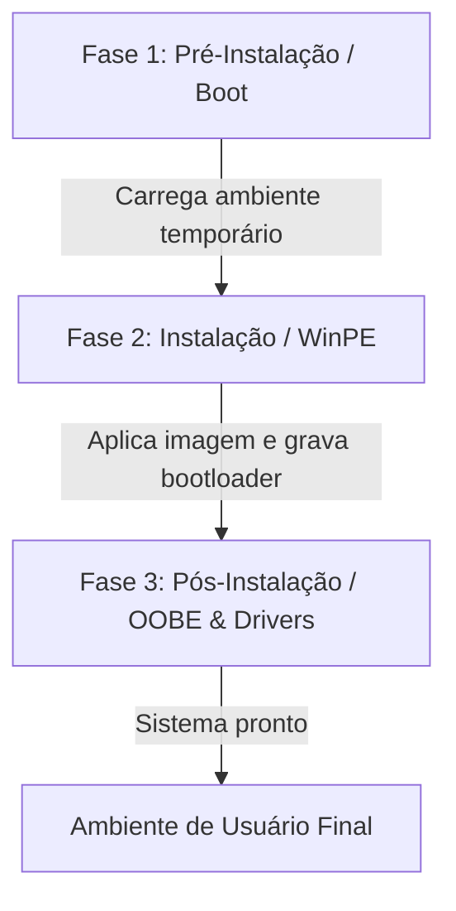
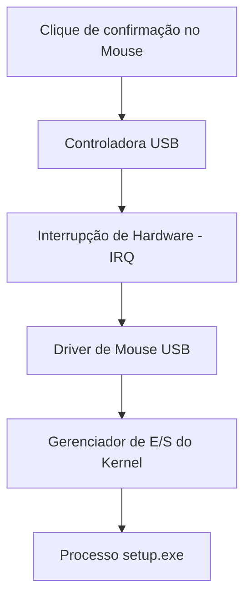

💻 Relatório Técnico: Formatação e Instalação do Windows x Arquitetura do SO
🛠️ Descrição Geral do Processo de Instalação
O processo de instalação do Windows transforma um conjunto de hardware inerte em um ambiente operacional funcional. O fluxo se divide em três fases principais:


    
Pré-Instalação (Boot & Firmware): O firmware da placa-mãe (UEFI/BIOS) realiza o teste de hardware (POST) e localiza o gerenciador de boot no pendrive inicializável.

Ambiente de Instalação (WinPE): Um mini-sistema operacional em memória RAM (Windows Preinstallation Environment) é carregado. Ele oferece uma interface para que o usuário particione o disco, formate o sistema de arquivos e selecione o destino da instalação. O instalador extrai a imagem do sistema (install.wim) para o disco local.

Pós-Instalação (OOBE & Configuração): O computador reinicia no disco local. O Windows detecta os dispositivos, instala drivers genéricos ou específicos, configura registros, cria contas de usuário e prepara a área de trabalho.

🧠 Análise dos 7 Conceitos Fundamentais da Arquitetura de SO
1. ⚙️ Componentes do Sistema Operacional
Durante a instalação, os principais componentes atuam de forma coordenada para gerenciar recursos críticos:

Gerenciador de Memória: Aloca a memória RAM para criar o disco virtual (RAM Disk) do WinPE e gerencia o buffer durante a cópia dos arquivos de instalação do pendrive para o disco rígido/SSD.

Gerenciador de Processos: Controla a execução do instalador (setup.exe), garantindo fatias de tempo de CPU para a descompressão de arquivos sem travar a interface gráfica.

Gerenciador de Disco e Sistema de Arquivos: Interpreta a tabela de partição (GPT/MBR) e grava a estrutura do sistema NTFS na unidade selecionada.

Subsistema de E/S (Entrada/Saída): Intermedia a leitura de dados na interface USB e a escrita no barramento NVMe/SATA.

2. 🛡️ Kernel: O Núcleo do Sistema
O Kernel NT é o coração do Windows. Ele passa a atuar logo após o bootloader carregar seus módulos essenciais na RAM.

```mermaid
flowchart LR
    Software[Aplicações / WinPE Setup] <-->|System Calls| Kernel[Kernel Windows NT]
    Kernel <-->|Drivers| Hardware[CPU / RAM / SSD / USB]
 ```   
Atuação: Controla diretamente a CPU, gerencia as interrupções de hardware e aloca endereços de memória física.

Controle na Instalação: O kernel impede que múltiplos processos tentem gravar no mesmo setor de disco simultaneamente e gerencia as taxas de transferência de dados do pendrive para a memória e da memória para o SSD.

3. 🔐 Modos de Execução: Modo Usuário vs. Modo Kernel
A CPU opera em diferentes níveis de privilégio (Anéis de Proteção / Protection Rings) para garantir a estabilidade do sistema.

Característica	Modo Usuário (User Mode / Ring 3)	Modo Kernel (Kernel Mode / Ring 0)
Acesso ao Hardware	Indireto (precisa de chamadas de sistema)	Direto e irrestrito
Execução de Código	Interface do Instalador (setup.exe), wizard de configuração	Kernel, Gerenciador de Memória, Drivers essenciais
Impacto de Falhas	O programa fecha, mas o sistema continua rodando	Resulta em Tela Azul da Morte (BSOD)
Por que restringir o acesso direto ao hardware?

Se qualquer programa pudesse escrever diretamente no SSD ou na RAM sem passar pelo SO, uma falha de programação no instalador poderia sobrescrever a tabela de partições de outro disco ou corromper a própria memória do sistema, causando travamentos irrecuperáveis e brechas de segurança.

4. ⚡ Processos
Um processo é um programa em execução, composto pelo código executável, alocação de memória, contexto de registradores e identificadores de recursos (handles).

Durante a instalação, o processo principal é o setup.exe. O SO gerencia esse processo através de:

Escalonamento de CPU: Concede ciclos de processamento ao setup.exe de acordo com sua prioridade.

Gerenciamento de Memória: Garantia de que as rotinas de descompressão do arquivo .wim tenham espaço alocado sem invadir a memória reservada de outros serviços do WinPE.

5. 🧩 Programa × Processo × Thread
Para exemplificar, consideremos a etapa de Cópia e Extração de Arquivos:
```mermaid
graph TD
    A[PROGRAMA: setup.exe no disco] -->|Carregado na RAM| B[PROCESSO: setup.exe em execução]
    B --> C[Thread 1: Interface Gráfica / Barra de Progresso]
    B --> D[Thread 2: Leitura do USB e Descompressão do WIM]
    B --> E[Thread 3: Escrita dos Dados no SSD]
```
Programa: O arquivo estático setup.exe armazenado no pendrive (código passivo no disco).

Processo: A instância em execução do setup.exe na RAM, possuindo um PID (Process ID), tabela de arquivos abertos e espaço de endereçamento.

Threads: Unidades básicas de execução dentro do processo setup.exe.

Vantagem do Multi-threading: A Thread 2 descompacta os arquivos pesados enquanto a Thread 1 atualiza a barra de progresso a 60 FPS. Sem múltiplas threads, a interface gráfica congelaria totalmente durante a leitura do disco.

6. 🗄️ Sistema de Arquivos
Diferenciar os conceitos de manipulação de disco é fundamental:

Apagar Dados: Remove as referências aos arquivos ou preenche setores com zeros, mantendo a estrutura da partição.

Particionar: Divide o disco físico em seções lógicas independentes (ex: criando tabelas GPT/MBR).

Formatar: Escreve as estruturas de controle do sistema de arquivos (como a Master File Table - MFT no NTFS) sobre uma partição.

Durante a instalação, o instalador cria partições obrigatórias (como a partição EFI em FAT32 para boot e a partição principal em NTFS). O NTFS permite ao Windows aplicar permissões de acesso (ACLs), compressão e logs de recuperação para a pasta C:\Windows.

7. 🔌 Entrada/Saída e Drivers de Dispositivos
O Windows interage com o hardware por meio do Subsistema de E/S e de Drivers (módulos de software que traduzem comandos genéricos do SO em instruções específicas de uma peça de hardware).

Na Instalação: O Windows utiliza drivers genéricos integrados à imagem do WinPE para garantir que dispositivos básicos (teclado, mouse, monitor VESA e SSDs padrão) funcionem imediatamente.

Após a Instalação: O Windows Update baixa drivers específicos (ex: Nvidia, Realtek, Intel) para desbloquear todo o desempenho do hardware (resolução nativa, áudio avançado, redes de alta velocidade).

⏳ Linha do Tempo e Tabela de Correlação

timeline
    title Linha do Tempo da Instalação do Windows
    Etapa 1 : Inicialização : Firmware UEFI/BIOS
    Etapa 2 : Carregamento WinPE : Kernel & RAM Disk
    Etapa 3 : Detecção de Hardware : Drivers Genéricos & E/S
    Etapa 4 : Seleção do Disco : Gerenciamento de Memória Secundária
    Etapa 5 : Particionamento / Formatação : Sistema de Arquivos NTFS
    Etapa 6 : Cópia de Arquivos : Processos & Threads
    Etapa 7 : Expansão e Escrita : Escalonamento e E/S
    Etapa 8 : Instalação de Drivers : Carregamento no Modo Kernel
    Etapa 9 : Primeiro Boot Local : Gerenciador de Inicialização (Bootmgr)
    Etapa 10 : Sistema Pronto : Transição para Modo Usuário (OOBE)
```mermaid
Etapa	O que acontece?	Conceito envolvido	Por que é importante?
1. Inicialização	POST do UEFI/BIOS e busca do dispositivo de boot.	Hardware e Firmware	Garante a integridade física inicial e localiza o código de boot.
2. Inicialização do instalador	Carga do WinPE para a RAM e boot do Kernel NT temporário.	Kernel e Gerenciador de Memória	Cria um ambiente em execução sem depender de um SO pré-instalado no HD.
3. Reconhecimento de hardware	Mapeamento da CPU, RAM, telas, teclado e unidades de disco.	Drivers de Dispositivos e E/S	Permite que o instalador interaja com o usuário e identifique o armazenamento.
4. Seleção da unidade	Usuário escolhe em qual disco/partição o Windows será gravado.	Gerenciador de Armazenamento	Define o destino físico onde a imagem do SO será descompactada.
5. Particionamento/formatação	Criação das partições EFI/NTFS e gravação da estrutura do MFT.	Sistema de Arquivos (NTFS/FAT32)	Organiza o disco para aceitar a estrutura de diretórios e permissões do Windows.
6. Cópia dos arquivos	Transferência da imagem install.wim do pendrive para o disco.	Entrada/Saída (E/S) e Buffers	Garante a integridade da transferência massiva de dados entre mídias.
7. Instalação do Windows	Descompressão e aplicação dos arquivos do sistema operacional.	Processos e Threads	Otimiza o tempo de extração usando threads paralelas sem travar a interface.
8. Instalação/configuração de drivers	Detecção fina de componentes e vinculação com drivers.	Modo Kernel e Drivers	Permite que o kernel explore a capacidade máxima do hardware instalado.
9. Inicialização do sistema	Reinicialização e boot direto pelo disco local recém-configurado.	Kernel e Bootloader	Transfere a execução do pendrive para a instalação definitiva no SSD.
10. Windows pronto	Abertura do ambiente de trabalho e inicialização da Shell gráfica.	Modo Usuário vs. Modo Kernel	Isola o usuário comum do núcleo do SO, garantindo estabilidade e segurança.
```
🧩 Desafio Final
1. Se não existisse um Sistema Operacional, o que precisaria ser feito manualmente?
Sem o Sistema Operacional, a abstração do hardware deixaria de existir. O usuário ou desenvolvedor do aplicativo precisaria:

Escrever rotinas em Assembly ou código de máquina para controlar os registradores de cada componente específico (ex: enviar instruções diretamente para o controlador SATA ler setor por setor).

Gerenciar manualmente os endereços de memória RAM hexadecimais, garantindo que uma instrução não sobrescreva a outra.

Implementar suas próprias rotinas de varredura de teclado, sinal de vídeo para a placa de som/vídeo e controle de interrupções de hardware (IRQs).

Implementar rotinas de parsing para interpretar arquivos cruamente do disco, pois não haveria conceito de "pastas" ou "arquivos" (como no NTFS).

2. Qual é o conceito mais importante na transição de Hardware para Sistema Funcional?
O Kernel (O Núcleo do Sistema).

Justificativa: O Kernel é o componente fundamental que atua como o verdadeiro tradutor e mediador entre o mundo do hardware (sinais elétricos, registradores e interrupções) e o mundo dos softwares (instruções abstratas de programas). Sem o kernel:

Não haveria gerenciamento de Modos de Execução, tornando o computador vulnerável a qualquer falha de código.

Não existiria a abstração de Processos e Threads, impedindo a concorrência segura na CPU.

Dispositivos de E/S e Sistemas de Arquivos seriam inatingíveis para softwares genéricos, pois o hardware só entende sinais elétricos brutos.

O kernel é a peça primária de software capaz de assumir o controle dos recursos da máquina e transformá-los em uma plataforma estável e multitarefa.
